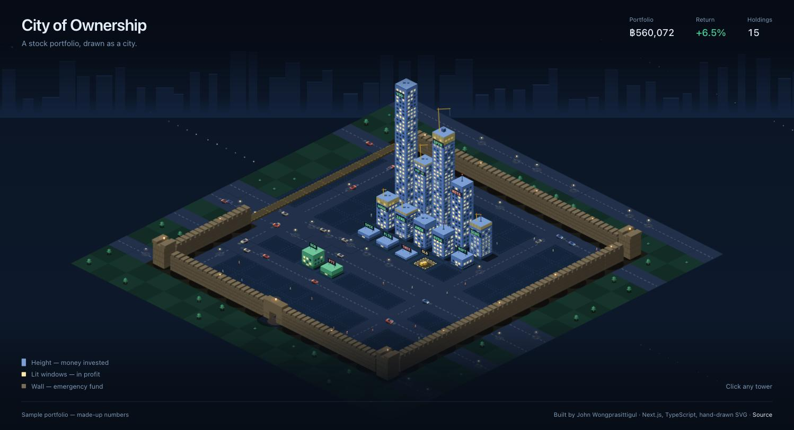

# City of Ownership

[](https://github.com/Johnoo007/ownership-visualizer/actions/workflows/ci.yml)

A stock portfolio, drawn as a city. Every holding is a tower; the city grows as you invest.

**[Live demo →](https://city-of-ownership.vercel.app/)** (sample data)



## Why

A brokerage app shows a list of numbers that jump around every day. That makes it easy to forget what you
actually *own*, and easy to panic when everything turns red. This app draws the portfolio as something you
build over time: money you put in becomes floors of a tower, and a market drop dims the lights but never
knocks a building down.

## How to read the city

| What you see | What it means |
| --- | --- |
| Tower height | Money invested in that holding. It only grows; market prices never shrink it. |
| Floors | Shares held |
| Lit windows | How far the holding is in profit (dimmer = deeper loss) |
| Sign colour | Gain or loss at a glance |
| Crane on the roof | Money was added in the last 7 days |
| City wall | Emergency fund, measured in months of expenses. A gap means it isn't complete yet. |
| Construction site | Cash waiting to be invested |
| Gold pile | A holding received for free (zero cost) |

## Design decisions

The interesting part of this project is deciding what each visual element is allowed to mean.

- **Height is money invested, not share count or market value.** Share count was rejected because a cheap
  stock with many shares would tower over an expensive one with few. Market value was rejected because
  towers would shrink in every downturn, which turns the app into a panic amplifier. So the encoding is
  split across three separate channels: height (invested), floors (shares), light (profit).
- **Towers never shrink.** The height scale is a fixed number of baht per pixel. An earlier version
  rescaled to the tallest tower, and adding money to the biggest holding made *every* tower shrink 29%.
  Now, when the city outgrows the screen, the camera pulls back instead. Holdings past a height cap split
  into a block of towers, and a tower that hits the cap stays at the cap, so no tower ever gets shorter.
- **The emergency fund is never added to portfolio value.** It isn't wealth that grows; it's money that
  sits ready. It's drawn as a wall (it doesn't make the city bigger, it keeps it from falling) and
  measured in months, not baht.
- **History can't lie.** Contributions are detected from changes in cost in the holding's own currency,
  so changing the exchange rate never creates fake top-ups. Emergency-fund changes are recorded as deltas,
  so correcting a typo never shows up as a withdrawal.
- **Private by default.** Portfolio data stays in the browser (localStorage). The public page at `/`
  always renders a sample city and never reads stored data.

The reasoning behind each rule is written next to the code that enforces it, and most rules are locked in
by a test.

## Tech

- Next.js 16 (App Router), React 19, TypeScript, Tailwind CSS v4
- The city is isometric SVG generated in code: no image assets, every building sized from data
- Live prices from Yahoo Finance through a Next.js API route (`/api/prices`)
- 63 tests with Vitest, including render tests that count the SVG elements actually drawn

```
src/app/page.tsx        Showcase (public home page, sample data)
src/app/app/page.tsx    Full tool: add holdings, sync prices, history, emergency fund
src/components/Iso*     Renderer: city, towers, ground, wall, construction sites
src/lib/                Pure logic: layout, portfolio math, contributions, reserve, storage
tests/                  Invariants (towers never shrink, cars stay on roads, ...)
```

## Running locally

```bash
npm install
npm run dev     # http://localhost:3000 (showcase) and /app (full tool)
npm test
npm run build
```

## How it was built

I built this with an AI coding assistant (Claude) as a pair programmer. I set the direction, made the
design calls and reviewed every change in the running app. Several of the core rules came out of that
review: catching that height-as-share-count was misleading, that cash should be loose construction
material rather than a building frame, and that the emergency-fund wall should protect the whole map,
cash included, not just the towers.
